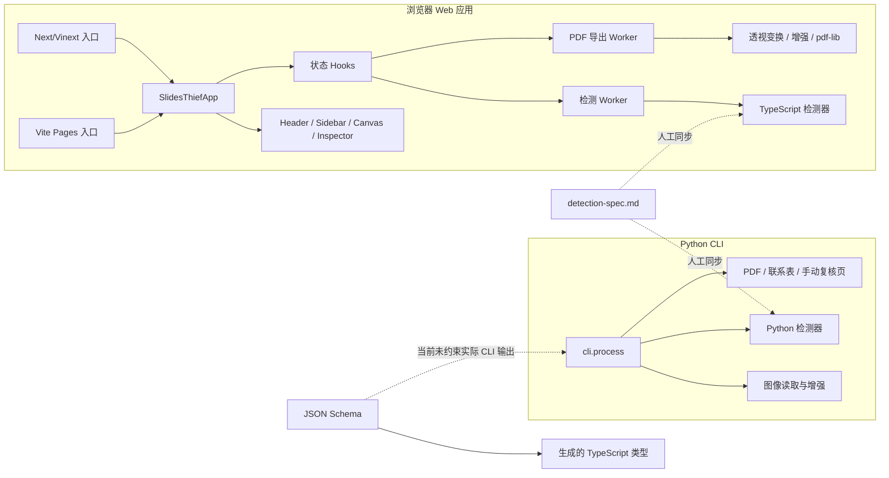

# Slides Thief 全量代码与架构审计报告

> 审计日期：2026-08-09  
> 审计版本：2.2.0  
> 审计范围：`src/`、`site/app/`、`site/build/`、`site/scripts/`、`scripts/`、`schemas/`、`tests/`、`site/tests/`、构建配置与相关产品/设计文档  
> 本报告只提出问题与解决方案，未修改业务代码。

## 1. 结论摘要

项目的核心功能分层方向是合理的：浏览器端把检测和 PDF 导出放入不同 Web Worker，Python CLI 也已将几何、检测、图像处理和导出拆成模块；隐私优先、四角顺序、双构建目标等关键约束基本得到保留。检测算法还具备可解释评分、置信度、批次先验和基准数据，这是值得保留的基础。

不过，当前版本存在 1 个会直接破坏 CLI 手动校正流程的 P0 问题、9 个 P1 问题，以及一批明显的架构与复用债务。最需要优先处理的不是视觉微调，而是以下五件事：

1. 修正 CLI 手动校正页的缩略图/原图坐标换算。
2. 恢复 Web 工程的 TypeScript 与 ESLint 质量门禁，并让 CI 真正执行类型检查。
3. 修正键盘导出闭包、检测任务竞态和自定义比例方向模型。
4. 让实际 CLI 报告与 JSON Schema 一致。
5. 为 Python/TypeScript 两套检测器建立同一套契约与跨实现一致性测试，阻止继续漂移。

### 问题统计

| 等级 | 数量 | 含义 |
| --- | ---: | --- |
| P0 | 1 | 关键工作流在常见输入下无法正确完成 |
| P1 | 9 | 发布阻断、错误结果、契约失真或明显安全/稳定性风险 |
| P2 | 12 | 中期维护成本、性能、复用和测试质量问题 |
| P3 | 2 | 低风险清理与一致性改进 |
| 合计 | 24 | 去重后的独立问题 |

### ROI 定义

| ROI | 定义 |
| --- | --- |
| 5 / 极高 | 小到中等投入即可消除高影响缺陷或长期系统性风险 |
| 4 / 高 | 收益明确，能显著改善可靠性、维护性或用户体验 |
| 3 / 中 | 有价值，但可在关键缺陷之后安排 |
| 2 / 低 | 收益有限或迁移成本较高 |
| 1 / 很低 | 暂不建议投入 |

## 2. 验证结果

| 检查 | 结果 | 说明 |
| --- | --- | --- |
| Python 测试 | 34/34 通过 | 使用项目 `.venv` 执行 |
| Ruff | 通过 | `src/` 与 `tests/` 无 Ruff 报错 |
| Web 测试 | 41/41 通过 | 同时完成 Sites/Vinext 与 GitHub Pages 构建 |
| TypeScript | 失败 | 25 个错误，包括错误参数类型、`.ts` 扩展配置、诊断对象推断和元组类型 |
| ESLint | 失败 | 45 项：9 个错误、36 个警告 |
| 前端机械审计 | 无额外命中 | 机械规则未发现新增模式，但不能覆盖闭包、竞态、契约和坐标语义问题 |
| 构建体积 | 有警告 | 导出 Worker 约 521 KB，HEIC 延迟块约 3.0 MB，构建报告存在 >500 KB chunk 警告 |

测试全绿与静态检查失败并不矛盾：当前测试重点在检测算法、构建产物和源码正则断言，几乎没有覆盖真实 UI 交互、Worker 并发、CLI 生成页面行为或“实际输出对 Schema”的验证。

## 3. 当前架构



主要架构风险在虚线部分：Schema 和检测规范目前只是“文档上的单一事实源”，并没有通过生成、验证或跨实现测试真正约束运行时代码。

## 4. 分级问题清单

### F-01 [P0] CLI 手动复核页使用了错误的坐标空间

- **位置**：`src/slides_thief/cli.py:115-127`、`src/slides_thief/exporter.py:309-328`、`src/slides_thief/exporter.py:370-408`
- **证据**：CLI 先把原图缩到最多 `1600×1200` 保存为复核图片，却把原图坐标系中的 `quad` 原样写入页面。页面只根据复核图片尺寸计算显示缩放，没有使用已写入数据的 `origWidth`、`origHeight`、`assetWidth`、`assetHeight`。
- **影响范围**：所有宽度大于 1600 或高度大于 1200 的 CLI 输入；现代手机照片通常都会命中。角点会落在错误位置甚至画布外，导出的 `manual_quads.json` 也会使用错误尺度，导致二次校正结果错误。
- **ROI**：5 / 极高；**工作量**：S。
- **最佳方案**：在复核数据中明确区分 `sourceQuad` 与 `assetQuad`。加载时按 `asset/source` 比例显示，导出时按反比例恢复原图坐标；对 X/Y 独立缩放。新增 4000×3000 → 1600×1200 的端到端坐标往返测试。

### F-02 [P1] 实际 CLI 报告不符合公开 JSON Schema

- **位置**：`src/slides_thief/cli.py:172-196`、`schemas/slide-lens-report.schema.json:15-45`
- **证据**：实际报告始终包含 `batch_summary`，但根 Schema 设置了 `additionalProperties: false` 且没有声明该字段。定向验证会得到：`Additional properties are not allowed ('batch_summary' was unexpected)`。
- **影响范围**：所有依赖公开 Schema 校验 `slide_lens_report.json` 的集成、自动化工具和下游消费者。
- **ROI**：5 / 极高；**工作量**：S。
- **最佳方案**：把 `batch_summary` 及 prior 结构正式加入 Schema，并让测试直接调用 `process()` 生成报告后校验，而不是校验手写的简化样例。生成的 `SlideLensReport` 类型也应反向用于报告构造边界。

### F-03 [P1] Python `box_blur` 每个轴都会少一个像素

- **位置**：`src/slides_thief/detection/detector.py:24-35`
- **证据**：输入 `(100, 160)` 实际输出 `(99, 159)`；累积和窗口没有在开头补零。后续检测仍按原始 `h/w` 设阈值与遍历范围，形成隐式坐标偏差。
- **影响范围**：Python `mask-lines` 检测的所有图片；边缘、密度和拟合点都会受到偏移，当前合成测试未覆盖输出尺寸不变这一基本不变量。
- **ROI**：5 / 极高；**工作量**：S。
- **最佳方案**：改成保持形状的积分图/滑窗实现，或复用经过验证的 separable box blur；先补充形状、常量图、边缘复制和 Python/TS 对齐测试。

### F-04 [P1] TypeScript 严格类型检查当前不可通过

- **位置**：`site/tsconfig.json`、`site/app/components/Header.tsx:189-210`、`site/app/slides-export-worker.ts:79-83`、`site/app/slides-worker.ts:143-150`、`site/app/SlidesThiefApp.tsx:1133-1145`、`site/app/detection/*.ts`
- **证据**：`npx tsc --noEmit` 报 25 个错误。主要类型错误包括把 `number` 当作 `Orientation`、诊断对象被推断为过窄、二维字符串数组未推断为元组；检测模块统一使用 `.ts` 后缀，但 `tsconfig` 未启用 `allowImportingTsExtensions`。
- **影响范围**：整个 Web 工程；重构失去编译器保护，错误参数已经对应到真实功能缺陷。
- **ROI**：5 / 极高；**工作量**：M。
- **最佳方案**：先确定模块策略：要么移除内部导入的 `.ts` 后缀，要么显式启用相应编译选项。逐个消除真实类型错误，并新增 `npm run typecheck`，纳入 CI 和 `npm test` 前置步骤。

### F-05 [P1] ESLint 失败，且当前 Pages CI 会被阻断

- **位置**：`site/app/components/*.tsx`、`site/app/SlidesThiefApp.tsx`、`.github/workflows/deploy-pages.yml:42-43`
- **证据**：Lint 报 9 个错误、36 个警告。错误集中在 `Record<string, any>`、`as any` 和空接口；警告包括 20 个未使用导入/变量和多个 Hook 缺失依赖。GitHub Pages 工作流明确在构建前执行 `npm run lint`。
- **影响范围**：当前主分支 Pages 部署、组件类型安全、Hook 正确性。
- **ROI**：5 / 极高；**工作量**：M。
- **最佳方案**：将 Lint 错误清零后把 `--max-warnings=0` 作为目标，而不是关闭规则。优先修复 Hook 依赖和真实死代码，再处理生成文件的定向 ignore。

### F-06 [P1] `Cmd/Ctrl+Enter` 导出快捷键持有陈旧闭包

- **位置**：`site/app/SlidesThiefApp.tsx:1042-1107`、`site/app/SlidesThiefApp.tsx:1010-1040`
- **证据**：全局键盘 Effect 调用 `exportPdf`，但依赖数组没有它。初次渲染时 `readySlides` 为空，旧闭包可能一直直接返回。`busyRef` 从未同步，始终为 `false`；`exportingRef` 创建后完全未使用。
- **影响范围**：桌面端承诺的核心键盘快捷键；关于弹窗和隐藏产品文案都宣称该快捷键可用。
- **ROI**：5 / 极高；**工作量**：S。
- **最佳方案**：把 `exportPdf` 改为依赖完整的 `useCallback` 并加入 Effect 依赖，或使用 React effect event/ref 模式读取最新状态；删除 `exportingRef`，同步或取消 `busyRef`。增加真实键盘事件测试。

### F-07 [P1] 检测任务缺少代次 ID，设置变更可产生竞态与旧结果覆盖

- **位置**：`site/app/SlidesThiefApp.tsx:944-983`、`site/app/components/Header.tsx:102-176`、`site/app/slides-worker.ts:26-38`
- **证据**：检测进行时 Header 设置仍可修改；修改格式会再次向同一 Worker 发送 `detect`。Worker 的异步 `onmessage` 没有 job ID、取消协议或串行队列，旧任务和新任务的结果都能更新同一 slide ID。
- **影响范围**：自动检测期间修改原稿格式/方向的用户；最终角点、置信度和缩略图可能来自旧设置，表现为非确定性错误。
- **ROI**：5 / 极高；**工作量**：M。
- **最佳方案**：每次检测生成递增 `jobId`，Worker 所有消息回传 `jobId`，主线程忽略非当前代次；启动新任务时可终止旧 Worker 或实现显式取消。Worker 内部也应保证同一 scope 串行处理。

### F-08 [P1] 自定义比例的方向状态不可表达，且调用处传错参数类型

- **位置**：`site/app/ratio.ts:93-132`、`site/app/components/Header.tsx:161-177`、`site/app/components/Header.tsx:189-210`、`site/app/slides-export-worker.ts:79-83`
- **证据**：`deriveSourceFormat("custom", "portrait")` 仍返回 `custom`，Settings 没有独立 orientation 字段，因此方向切换不产生持久状态。多个调用把 `selectedSlide.sourceRatio`（number）传给 `sourceFormatRatioValue` 的 `orientation` 参数，这也是 TypeScript 报错来源。
- **影响范围**：自定义比例纵向输入、纸张默认方向、导出比例计算。
- **ROI**：5 / 极高；**工作量**：M。
- **最佳方案**：将 `sourceFormat` 拆为 `{ baseFormat, orientation, customRatio }` 或至少新增 `sourceOrientation`；函数只接受一个结构化参数，避免三个位置参数被误传。对 custom landscape/portrait、检测、缩略图和导出做同一组表驱动测试。

### F-09 [P1] Python 与 TypeScript 检测器已出现规范漂移

- **位置**：`src/slides_thief/detection/`、`site/app/detection/`、`docs/detection-spec.md`
- **证据**：规范要求候选去重使用精确凸多边形 IoU，但 Web 在 `site/app/detection/detect.ts:143-145` 使用栅格采样 `quadIoU`，已有 `convexQuadIoU` 却只用于置信度；Python 版本使用精确裁剪。另有候选数量、Hough 线段阈值、梯度缩放插值和采样策略差异。
- **影响范围**：CLI 与 Web 对相同图片可能给出不同角点、方法、置信度和复核结论；任何算法调参都要双倍修改且容易漏改。
- **ROI**：5 / 极高；**工作量**：L。
- **最佳方案**：短期先建立共享 fixture 的跨实现 golden contract，比较 quad、方法、置信度区间和 review reason；把全部阈值放入同一份机器可读配置并生成两端常量。中期评估以 WASM/共享核心统一算法，或明确“规范一致、实现可不同”的容差边界。

### F-10 [P1] CLI 手动复核 HTML 存在本地脚本注入与可访问性缺口

- **位置**：`src/slides_thief/exporter.py:53-434`
- **证据**：未转义的 JSON 直接嵌入 `<script>`，文件名若含 `</script>` 可提前结束脚本；之后又通过 `innerHTML` 写入文件名。角点只绑定 mouse 事件，没有 Pointer/Touch 与键盘操作；缩略图使用可点击 `div`，无语义和键盘支持。
- **影响范围**：打开含恶意/异常文件名的复核页可能执行注入脚本；触摸设备和仅键盘用户无法完成核心校正任务。
- **ROI**：4 / 高；**工作量**：M。
- **最佳方案**：将数据放入 `application/json` script 并转义 `<`，所有动态内容使用 `textContent`；改用按钮和 Pointer Events，为四个角点提供可聚焦控件、方向键微调和状态播报。最好把复核页模板从 380 行 f-string 独立为可测试资产。

### F-11 [已处理] `SlidesThiefApp` 的领域职责已拆分

- **处理**：主组件已从约 1260 行收敛到约 630 行，导入、画布视口、四边形编辑、键盘监听和偏好设置分别由 `site/app/hooks/useImportPipeline.ts`、`useCanvasViewport.ts`、`useQuadEditor.ts`、`useKeyboardShortcuts.ts`、`usePreferences.ts` 负责；检测与导出 Worker 继续复用现有 hooks。
- **额外修复**：四边形方向键调整现在会写入 undo history；键盘全局监听改为稳定 listener + 最新 action ref，避免闭包过期和重复绑定。
- **验证**：当前 `typecheck`、严格 lint、服务器端构建、GitHub Pages 构建及 Web 测试（47/47）通过。原审查中提到的“20 个未使用项及 Hook 警告”在当前基线无法复现。

### F-12 [P2] Header 承担过多设置状态转换，重复 UI 也未复用

- **位置**：`site/app/components/Header.tsx`、`site/app/SlidesThiefApp.tsx:1249-1283`
- **证据**：Header 389 行，直接编码比例/方向/纸张状态机。主题和语言选择器在 Header 移动菜单与桌面 footer 中重复实现；Info 按钮也有两套结构。所有文案 Props 使用 `Record<string, any>`。
- **影响范围**：设置逻辑、响应式一致性、类型安全和后续新增选项。
- **ROI**：4 / 高；**工作量**：M。
- **最佳方案**：提取 `PreferencesControls`、`SourceFormatControls`、`OutputPageControls`，让桌面与移动只决定容器布局；状态转换集中为纯 reducer/函数并做表驱动测试。

### F-13 [P2] UI 原语仍依赖页面级 CSS 类名，不是稳定的组件 API

- **位置**：`site/app/components/ui/Button.tsx`、`Badge.tsx`、`Select.tsx`、`site/app/globals.css`
- **证据**：Button 的 `variant` 通过多层三元表达式映射到 `closeButton`、`fitButton`、`clearAllBtn` 等页面语义类；`green` 是颜色而不是语义；删除按钮和多个普通按钮又绕过 Button。`SelectProps` 是空接口并触发 Lint 错误。
- **影响范围**：相似组件的视觉与交互漂移、触控尺寸、主题和可访问性状态。
- **ROI**：4 / 高；**工作量**：M。
- **最佳方案**：将 variant 收敛为 `primary/secondary/accent/ghost/icon/danger`，尺寸独立为 `sm/md/touch`；页面用途通过 `className` 或专用包装组件表达。把嵌套的 slide row 改为真正可选择的按钮/列表项，删除按钮作为同级操作，避免交互元素嵌套。

### F-14 [P2] 设计系统文档与 CSS 实现存在持续漂移

- **位置**：`DESIGN.md`、`.impeccable/design.json`、`site/app/globals.css`
- **证据**：设计文档定义了圆角、间距、字体层级和 900px 响应式行为，但 CSS 只对颜色做了较完整 token 化，仍散布大量 `6/7/8/12px`、`34/44px` 等硬编码；实际断点为 1040/834px。设计 sidecar 也已落后于 `DESIGN.md`。
- **影响范围**：全站组件一致性、响应式维护和未来视觉迭代。
- **ROI**：3 / 中；**工作量**：M。
- **最佳方案**：先以实际产品为准重新确认 DESIGN.md，再建立 primitive → semantic → component 三层 token；把 radius、spacing、control height、breakpoint 和 shadow 纳入变量。完成代码调整后再运行 `$impeccable document` 刷新 sidecar，而不是仅修改 sidecar。

### F-15 [P2] 检测代码内部存在大量可消除的重复实现

- **位置**：`src/slides_thief/detection/scoring.py`、`refine.py`、`hough_lines.py`；`site/app/detection/*.ts`
- **证据**：Python 多处重复 polygon area、geometry validity、intersection；Web 四个检测器各自定义 `EMPTY_FEATURES`，`clamp/round/average/percentile` 多次重复，Hough 又重复 quad distance。重复实现的校验规则已经不完全一致。
- **影响范围**：算法修复需多点同步，容易出现阈值和边界行为漂移。
- **ROI**：4 / 高；**工作量**：M。
- **最佳方案**：建立 `geometry`、`numeric`、`candidate-factory` 三个内部模块；唯一导出 `geometryIsValid`、精确 IoU、统计函数和 `emptyCandidateFeatures()`。重构前先锁定基准和跨实现 golden tests。

### F-16 [P2] 缩略图与最终导出维护两套透视采样循环

- **位置**：`site/app/lib/slide-utils.ts:171-245`、`site/app/slides-export-worker.ts:110-236`
- **证据**：两处都执行 source 缩放、透视系数、越界填充、内容提取、增强和回填；缩略图采用最近邻，最终导出采用双线性，边缘处理也分别编码。
- **影响范围**：预览与最终 PDF 可能不一致；修复填充、插值和性能问题需要改两处。
- **ROI**：4 / 高；**工作量**：M。
- **最佳方案**：提取纯函数 `renderPerspectivePage(source, quad, options)`，由 DOM Canvas 与 OffscreenCanvas 适配器调用；通过小尺寸 ImageData golden test 保证缩略图和导出只在明确的质量参数上不同。

### F-17 [P2] 类型与状态模型把检测方法、处理状态和人工状态混在一起

- **位置**：`site/app/lib/types.ts:31-51`、`site/app/SlidesThiefApp.tsx:508-526`、`site/app/hooks/useDetectionWorker.ts`
- **证据**：`SlideItem.method` 只是 `string`，同时存放 `queued`、`converting`、`detecting`、`conversion-error`、`manual` 和真实检测器方法；`reviewedByUser`、`quad != autoQuad`、`method === manual` 又表达相近状态。
- **影响范围**：状态判断分散，新增阶段或错误类型时容易产生非法组合。
- **ROI**：4 / 高；**工作量**：M。
- **最佳方案**：使用判别联合：处理阶段独立为 `status`，检测来源为 `DetectionMethod | manual | null`，错误带结构化 code，人工编辑状态由单一字段表达。Worker 协议也用同一套共享类型并在边界做运行时校验。

### F-18 [P2] 测试大量断言源码字符串，未验证用户行为

- **位置**：`site/tests/rendered-html.test.mjs:63-296`
- **证据**：单个测试读取十多个源码文件并以正则匹配实现细节，如函数名、CSS 文本和调用顺序。它会阻碍安全重构，却没有发现快捷键失效、Worker 竞态、自定义方向错误或交互嵌套问题。
- **影响范围**：测试维护成本和缺陷检出率；代码“看起来包含某字符串”即可通过。
- **ROI**：5 / 极高；**工作量**：L。
- **最佳方案**：保留少量静态隐私契约断言，其余迁移到 React 组件测试和 Playwright：文件导入 → 自动检测 → 拖角点 → 撤销/重做 → 键盘导出 → 下载。两种构建目标各跑一个 smoke test。

### F-19 [P2] Schema 已生成类型，但没有真正约束生产代码

- **位置**：`site/app/schemas/`、`site/app/lib/export-utils.ts`、`src/slides_thief/cli.py`
- **证据**：`SlideLensReport`、`ReportQuad`、`ReportPoint` 没有生产调用方；`ManualQuads` 只用于当前 UI 未调用的 `exportManualQuads`。CLI 读取 `--manual` 时直接 `json.load`，不验证点数、数值、顺序或边界。
- **影响范围**：坏输入可能在 NumPy/Pillow 变换阶段才以难懂错误失败；Schema 漂移不会被编译器发现。
- **ROI**：4 / 高；**工作量**：M。
- **最佳方案**：CLI 入口使用 JSON Schema 或轻量 dataclass 校验，错误信息定位到文件名/角点；Web 导入导出边界使用生成类型与运行时 validator；新增实际生产对象的 Schema 往返测试。

### F-20 [P2] Python 检测只限制宽度，极端竖图仍可能占用大量内存

- **位置**：`src/slides_thief/detection/detector.py:218-247`、`site/app/slides-worker.ts:211-225`
- **证据**：Python 只按 `max_width/orig_w` 缩放；窄而极高的图片可能不缩小。Web 已同时限制最大宽度和 1.2M 像素，说明项目已有正确的资源预算模型但未复用到 CLI。
- **影响范围**：全景图、长截图、损坏元数据或异常竖图；梯度金字塔会分配多份 Float64 数组，可能导致内存峰值和长时间处理。
- **ROI**：4 / 高；**工作量**：S。
- **最佳方案**：Python 增加 `max_pixels` 与最大边限制，X/Y 独立映射回原图；和 Web 共用同一组边界测试。

### F-21 [P2] Web 梯度阈值通过全量排序求百分位，时间和内存复杂度偏高

- **位置**：`site/app/detection/gradient-pyramid.ts:49-53`、`site/app/detection/image-features.ts:60-64`
- **证据**：对最多约 120 万个元素执行 `Array.from(...).sort()`，同时发生 TypedArray → 普通数组复制。检测流程还会对灰度、饱和度多次做同类排序。
- **影响范围**：大图自动检测启动延迟和 Worker 内存峰值；基准 fixture 只有 320×240，不能代表上限输入。
- **ROI**：4 / 高；**工作量**：M。
- **最佳方案**：0-255 灰度/饱和度用固定直方图，梯度用 quickselect、分桶或有界采样；补充接近 1.2M 像素的性能预算测试。

### F-22 [P2] CLI 对同一图片重复打开/解码，联系表也未显式关闭文件

- **位置**：`src/slides_thief/cli.py:81-113`、`src/slides_thief/exporter.py:42-49`
- **证据**：每张图在初检、批次重检和最终输出阶段可能重复 `Image.open(...).convert(...)`；联系表循环直接 `Image.open`，没有 context manager。
- **影响范围**：大批量任务的 IO、CPU 和文件描述符占用。
- **ROI**：3 / 中；**工作量**：M。
- **最佳方案**：用 context manager 明确关闭，缓存已转置的尺寸/路径和必要的缩略图；是否缓存完整像素应由内存预算决定，不建议无上限常驻所有原图。

### F-23 [P3] 死代码、残留 API 与未使用依赖（已关闭）

- **复核结论**：该项部分成立。`chatgpt-auth.ts` 没有调用方，Hough segment 的 `start/end` 没有读取，Tailwind/PostCSS 只服务于未使用的 Tailwind 导入，`next.config.ts` 也只有占位配置；这些内容已删除。
- **误报/已保留项**：`SlidesThiefApp.tsx` 中报告列出的导入和变量当前均有 UI 或 hook 调用方；`exportManualQuads` 已接入侧栏导出按钮；`isPaperRatio` 被设置状态迁移逻辑使用；export worker 中报告的若干符号在当前版本已不存在或并非未使用。
- **影响范围**：降低认知负担和依赖安装体积，避免构建链与产品 CSS 体系不一致；未改变用户可见功能。
- **ROI**：4 / 高仍合理；**工作量**：XS-S（删除残留和同步 lockfile）。
- **处理方式**：移除无调用方文件、空配置、Hough 未使用字段、Tailwind 导入及两项开发依赖；保留仍在产品路径中的 API，并通过类型检查、Lint、双构建和测试验证。

### F-24 [P3] 产品能力、比例预设和品牌文案在代码/文档间不一致（已关闭）

- **位置**：`site/README.md:17`、`docs/faq.md:21-23`、`README.md:60-65`、`site/app/components/Header.tsx:117-249`、`src/slides_thief/exporter.py:56,205`
- **修复记录（F-24）**：Web README 已改为混合检测器表述；Web 已补齐 A3 横/纵向纸张输出、类型与 PDF 点尺寸；CLI 复核页统一使用 Slides Thief 品牌名。比例、格式能力、品牌和版本现由 `metadata/product.json` 生成到 Python、TypeScript、公开 JSON、SEO 能力列表和带标记的公开文档片段。
- **比例约束**：纸张预设不再手写 `ratio`，统一由 `width_points / height_points` 计算；生成器拒绝纸张条目重新引入 `ratio`，并覆盖 A3/A4/A5/Letter 的 Python 与 Web 回归测试。
- **文档约束**：README、FAQ、CLI 文档、站点 README、`llms.txt`、`llms-full.txt`、PRODUCT.md 和中英文产品能力片段均由生成器写入；CI 的生成物 `--check` 会同时发现这些文档片段漂移。
- **验证结果**：元数据生成检查、Python 70/70、Ruff、TypeScript、ESLint、Node 77/77、组件 1/1、Server/Pages E2E 2/2、双构建和 `git diff --check` 均通过。
- **影响范围**：用户预期、支持请求、自动化文档消费者和品牌一致性。
- **ROI**：4 / 高；**工作量**：S。
- **最佳方案**：先决定 Web 是否真正支持 A3；若支持则加入类型、UI 和 PDF 点尺寸，否则修正文档。把产品名、URL、版本、格式能力和比例预设集中为可生成的元数据源。

## 5. 前端技术审计评分

| # | 维度 | 分数 | 关键结论 |
| --- | --- | ---: | --- |
| 1 | 可访问性 | 3/4 | 主 Web 画布有键盘角点、焦点环、modal focus trap；但 slide row 交互嵌套和 CLI 复核页不可键盘/触摸操作 |
| 2 | 性能 | 2/4 | Worker 隔离和图片预算较好；全量排序、重复透视循环及大 chunk 仍有明显优化空间 |
| 3 | 响应式 | 3/4 | 834/1040px 断点与 coarse pointer 适配较完整；实现和 DESIGN.md 描述不一致 |
| 4 | 主题 | 3/4 | 颜色 token 与暗色模式较完整；间距、圆角、阴影和组件尺寸尚未系统化 |
| 5 | 实现完整性 | 1/4 | 类型/Lint 失败、快捷键闭包、任务竞态、双实现漂移和设计 sidecar 失配 |
| **总分** |  | **12/20** | **可接受，但需要显著整改** |

**实现完整性判定：不通过。** 界面已经表达出明确的产品特征和视觉体系，不是通用模板；但静态质量门禁失败、状态模型和组件 API 不稳定，且已存在可复现的功能性缺陷。

## 6. 系统性模式与根因

### 6.1 “文档是单一事实源”，但没有机器约束

检测规范、JSON Schema、DESIGN.md 都写得较完整，却没有成为生成代码或 CI 验证的一部分，因此出现了精确 IoU/栅格 IoU、`batch_summary`、A3 支持和响应式断点等漂移。

### 6.2 双实现与双构建都缺少共享契约层

Python/TS 检测器和 Next/Vite 两套页面入口是产品要求，但当前共享主要靠复制。应共享“数据、常量、fixture 和行为契约”，不一定强行共享所有运行时代码。

### 6.3 测试偏实现形态，缺少关键工作流

算法单测质量不错，但 UI 测试大量匹配源码文本；CLI 测试只确认 HTML 文件存在，没有加载页面验证坐标。测试结构直接解释了为什么 75 个测试通过仍遗漏 P0/P1 问题。

### 6.4 类型被当作局部注释，而不是跨模块契约

`Record<string, any>`、`method: string`、Worker `event.data` 和未使用的生成 Schema 类型削弱了 TypeScript 的价值；类型检查现已进入默认测试脚本，后续仍应继续收窄跨模块契约。

## 7. 值得保留的实现

- 浏览器源图片保持本地处理，检测与 PDF 导出都在 Worker 中完成。
- Worker 对检测和导出设置了像素预算，并正确关闭 `ImageBitmap`。
- 画布角点具备 Pointer Events、48px 命中区、键盘微调、焦点样式和 aria-live 播报。
- About modal 有 Escape、焦点循环和焦点恢复处理。
- 检测器具有候选评分、边缘证据、置信度拆解、批次先验和回退复核标记。
- Python 与 Web 都有确定性困难边界测试和基准数据，适合扩展为跨实现契约测试。
- 两种 Web 构建目标都有回归测试，公开 URL 和本地隐私约束没有被破坏。
- 版本同步已有自动测试，发布元数据的基础治理良好。

## 8. 推荐实施路线

### 阶段 A：发布阻断与正确性（优先）

1. 修复 F-01、F-02、F-03，并为每项先加失败测试。
2. 修复 F-04、F-05，让 `typecheck + lint + test` 全绿并进入 CI。
3. 修复 F-06、F-07、F-08，增加键盘、自定义比例与任务代次行为测试。
4. 修复 F-10 的数据转义和输入可访问性。

### 阶段 B：契约和状态模型

1. 为实际 CLI report/manual input 启用 Schema 校验（F-19）。
2. 建立 Python/TS 跨实现 golden suite，先记录容差再收敛差异（F-09）。
3. 重构 SlideItem 和 Worker 协议为判别联合（F-17）。
4. 补充大图资源预算和性能测试（F-20、F-21）。

### 阶段 C：复用与维护成本

1. 拆分 `SlidesThiefApp` 与 Header（F-11、F-12）。
2. 统一 UI 原语和设计 token（F-13、F-14）。
3. 合并检测 helper 与透视渲染核心（F-15、F-16）。
4. 将源码正则测试迁移为行为测试（F-18）。
5. F-23、F-24 已完成；后续新增产品能力应继续通过 `metadata/product.json` 和生成器进入代码、文档与 SEO。

## 9. 建议质量门禁

```text
Python:
  ruff check src tests
  pytest
  实际 CLI 输出 × JSON Schema
  Python/TS shared-fixture parity

Web:
  build:schemas --check（生成后 git diff 必须为空）
  tsc --noEmit
  eslint --max-warnings=0
  unit tests
  Next/Vinext build smoke
  GitHub Pages build smoke
  Playwright 关键流程

性能:
  320×240 精度基准
  接近 1.2M 像素检测预算
  8M 像素导出预算
  主线程长任务与 Worker 峰值内存
```

## 10. 逐文件审查索引

下表记录本次审查覆盖，避免“只看了大文件”的歧义。生成物、二进制图片、fixture 图片和 lockfile 未逐行人工审查，但已纳入构建/测试验证。

| 文件/目录 | 结论或关联问题 |
| --- | --- |
| `src/slides_thief/__init__.py` | 简洁；版本单一来源有效 |
| `src/slides_thief/cli.py` | F-01、F-02、F-19、F-22；编排职责偏重 |
| `src/slides_thief/exporter.py` | F-01、F-10、F-22、F-24；内嵌 HTML/CSS/JS 过大 |
| `src/slides_thief/geometry.py` | F-09、F-15、F-24；比例表与其他端重复 |
| `src/slides_thief/image_processing.py` | 主流程清晰；未知 enhancement 会隐式落到 clean，建议显式校验 |
| `src/slides_thief/detection/types.py` | 类型契约方向正确，但运行代码仍大量使用裸 dict |
| `src/slides_thief/detection/gradient.py` | F-09；与 Web 插值策略不同 |
| `src/slides_thief/detection/batch_prior.py` | 算法清晰；裸 dict 与阈值重复 |
| `src/slides_thief/detection/confidence.py` | 精确 IoU 实现可复用，当前与 Web 去重策略不一致 |
| `src/slides_thief/detection/refine.py` | F-15；几何校验和交点重复 |
| `src/slides_thief/detection/scoring.py` | F-15；几何与多边形逻辑重复 |
| `src/slides_thief/detection/hough_lines.py` | F-09、F-15；内部几何 helper 重复 |
| `src/slides_thief/detection/detector.py` | F-03、F-09、F-20；核心函数过长、阈值密集 |
| `site/app/SlidesThiefApp.tsx` | F-05、F-06、F-07、F-11、F-17 |
| `site/app/components/Header.tsx` | F-08、F-12；设置状态机和重复控件 |
| `site/app/components/SlideSidebar.tsx` | F-05、F-13；role=button 内嵌 button，类型被 `any` 绕过 |
| `site/app/components/CanvasQuadEditor.tsx` | Web 端可访问性基础较好；文案类型仍为 any |
| `site/app/components/InspectorPanel.tsx` | 结构简单；文案和 metrics 类型可加强 |
| `site/app/components/AboutModal.tsx` | 焦点管理由父组件完成且较完整；文案类型需收敛 |
| `site/app/components/ui/*` | F-13；Button variant 与页面 CSS 强耦合 |
| `site/app/hooks/useSlideDeck.ts` | 历史快照清晰；有未使用导入，选择状态不进入历史属合理取舍 |
| `site/app/hooks/useDetectionWorker.ts` | F-07、F-17；缺 jobId/运行时消息校验 |
| `site/app/hooks/useExportWorker.ts` | Worker 释放较好；可与检测 Worker 抽取公共生命周期 helper |
| `site/app/slides-worker.ts` | F-04、F-07、F-09；两遍检测设计合理但结果未做代次隔离 |
| `site/app/slides-export-worker.ts` | F-04、F-16 |
| `site/app/detection/types.ts` | 契约较完整；应延伸到 SlideItem/Worker 边界 |
| `site/app/detection/geometry.ts` | F-09、F-15；同时存在栅格和精确 IoU，调用选择错误 |
| `site/app/detection/gradient-pyramid.ts` | F-09、F-21 |
| `site/app/detection/image-features.ts` | F-21；全量排序重复 |
| `site/app/detection/batch-prior.ts` | F-15；`EMPTY_FEATURES` 与数值 helper 重复 |
| `site/app/detection/confidence.ts` | 精确 IoU 调用正确；helper 可统一 |
| `site/app/detection/candidate-scorer.ts` | 结构清楚；与 Python scorer 双维护 |
| `site/app/detection/quad-refiner.ts` | 结构清楚；与 Python refiner 双维护 |
| `site/app/detection/mask-lines.ts` | F-15；line fit/helper 可下沉 |
| `site/app/detection/contrast-lines.ts` | F-09、F-15；候选数量与 Python 不同 |
| `site/app/detection/hough-lines.ts` | F-09、F-15 |
| `site/app/detection/detect.ts` | F-09；去重使用了栅格 IoU |
| `site/app/lib/types.ts` | F-17；HEIF MIME Set 重复 `image/heic-sequence`，遗漏 `image/heif-sequence` |
| `site/app/lib/slide-utils.ts` | F-08、F-16；`resolvedSlideRatio` 的 slide 参数未使用 |
| `site/app/lib/canvas-utils.ts` | 边界处理可复用；部分小数组写法可优化但非优先 |
| `site/app/lib/perspective.ts` | 线性求解简洁；建议增加奇异矩阵显式错误 |
| `site/app/lib/export-utils.ts` | F-19；已由侧栏导出流程调用 |
| `site/app/ratio.ts` | F-08、F-24；比例与方向模型需要结构化，`isPaperRatio` 有实际调用方 |
| `site/app/enhance.ts` | 逻辑独立，适合保留；与 Python 结果只有参数相似、无一致性测试 |
| `site/app/image-sizing.ts` | 小而明确，测试充分；应复用到 Python 设计 |
| `site/app/filename.ts` | 小而明确，Unicode/保留名测试较好 |
| `site/app/i18n.ts` | F-12；内容完整但单文件过大，组件端未复用其推断类型 |
| `site/app/page.tsx`、`layout.tsx` | 双入口所需；元数据与静态 HTML 重复，viewport patch 较脆弱 |
| `site/app/pages-main.tsx`、`site/pages/index.html` | GitHub Pages 必需；SEO/metadata 与 Next 入口重复维护 |
| `site/app/ProductInfo.tsx` | 隐藏 SEO 文案与静态 HTML/metadata 重复，需防内容漂移 |
| `site/app/globals.css` | F-14；1982 行单文件，token 只覆盖部分设计维度 |
| `site/build/sites-vite-plugin.ts` | 简洁，满足 Sites 元数据打包需求 |
| `site/vite.config.ts`、`vite.pages.config.ts` | 双构建职责清楚；应共享 metadata/构建常量 |
| `site/scripts/build-schemas.mjs` | 生成流程有效；建议加入 `--check` 模式并避免无条件改写 |
| `site/scripts/evaluate-detection.mjs` | 与 Python benchmark 重复，适合成为跨实现比较入口 |
| `scripts/evaluate_detection.py` | 基准结构清楚；fixture 太少，不足以支撑泛化结论 |
| `schemas/*.json` | F-02、F-19；manual schema 基础正确，report schema 已漂移 |
| `tests/*.py` | 算法覆盖良好；`test_modules` 与 `test_cli` 有部分重复，缺实际 process/schema 与复核页行为 |
| `site/tests/detection-*.mjs` | 算法覆盖良好，但与 Python 是复制式测试，尚未比较两端结果 |
| `site/tests/rendered-html.test.mjs` | F-18；源码正则过多 |
| `site/tests/static-pages.test.mjs` | 双构建 smoke 有价值，应保留 |
| `site/tests/ratio.test.mjs` | F-08 未覆盖 custom orientation 的状态持久化 |
| `site/tests/perspective-and-canvas.test.mjs` | 基础数学覆盖合理；缺预览/导出一致性 golden test |
| `pyproject.toml` | dev 依赖未声明 `jsonschema`，新环境运行测试可能失败 |
| `site/package.json` | F-04；已有 `typecheck` 脚本并作为 `npm test` 前置步骤，CSS 使用手写样式且不依赖 Tailwind |
| `.github/workflows/deploy-pages.yml` | 会正确运行 Lint，但缺 TypeScript、Python 和双端契约检查 |

## 11. 暂不建议的改法

- 不建议为了“去重”直接把所有 Python 检测代码机械翻译为单个巨大 TS/Python 文件；先建立跨实现契约再决定共享技术。
- 不建议在没有基准保护时集中重写检测算法；当前精度数据虽然样本少，但仍是有价值的回归线。
- 不建议把所有状态放入单一全局 store 作为第一步；当前最危险的是任务代次、闭包和状态语义，先修边界再决定状态库。
- 不建议只通过关闭 ESLint/TypeScript 规则让 CI 变绿；现有错误已经对应真实缺陷。
- 不建议先做大规模视觉重设计；当前设计识别度和主题基础尚可，正确性与实现完整性优先级更高。

---

本报告建议在每个阶段完成后重新运行：Python 测试、Ruff、TypeScript、ESLint、两种 Web 构建、跨实现检测 fixture，以及至少一条完整的浏览器用户流程。
