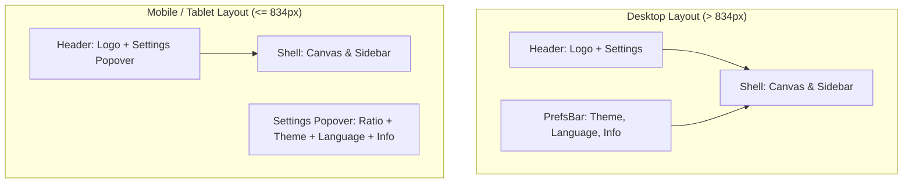

# Implementation Plan: Fold Preferences into Settings Popover on Mobile & Tablet

> **For agentic workers:** REQUIRED SUB-SKILL: Use superpowers:subagent-driven-development to implement this plan task-by-task. Steps use checkbox (`- [ ]`) syntax for tracking.

**Goal:** Hide the standalone bottom bar (`.prefsBar`) on mobile/tablet viewports (`<= 834px`) to free up ~60px of vertical space for the stage/canvas, and fold Theme, Language, and Info controls into the `settingsMenu` popover.

**Architecture:** Update `SlidesThiefApp.tsx` to render theme, language, and info controls inside `settingsMenuBody`. Update `globals.css` to hide `.prefsBar` on `<= 834px` viewports, update `.app` grid template areas, and style the preference controls in `settingsMenuBody`. Update test assertions in `rendered-html.test.mjs`.

**Architecture Diagram:**



**Tech Stack:** React, TypeScript, CSS, Node test runner

## Global Constraints
- Target breakpoint threshold: `834px`
- Desktop layout (`> 834px`) must remain unchanged
- SSR & static HTML test assertions must pass
- Corner order invariant: top-left, top-right, bottom-right, bottom-left

---

### Task 1: Add Theme, Language, and Info Controls into `settingsMenuBody` in `SlidesThiefApp.tsx`

**Files:**
- Modify: `site/app/SlidesThiefApp.tsx:2845-2855`

- [ ] **Step 1: Add Theme, Language, and Info controls inside `settingsMenuBody`**

In [SlidesThiefApp.tsx](file:///Volumes/SN5100/Users/waittim/Documents/Code/Slides-Thief/site/app/SlidesThiefApp.tsx), inside `settingsMenuBody` (after `pdfNameSetting`):
Render `.themeSetting`, `.languageSetting`, and `.infoSetting` controls so mobile/tablet users can configure theme, language, and open info modal directly from Settings.

- [ ] **Step 2: Run site build & tests**

Run: `cd site && npm test`

- [ ] **Step 3: Commit TSX changes**

```bash
git add site/app/SlidesThiefApp.tsx
git commit -m "feat(site): fold theme, language, and info controls into settings popover"
```

---

### Task 2: Hide `.prefsBar` and Update `.app` Grid Layout in `globals.css` & Update Tests

**Files:**
- Modify: `site/app/globals.css:1050-1110,1236-1320`
- Modify: `site/tests/rendered-html.test.mjs:199`

- [ ] **Step 1: Update CSS for `.prefsBar` and `.app` grid template under `@media (max-width: 834px)`**

In [globals.css](file:///Volumes/SN5100/Users/waittim/Documents/Code/Slides-Thief/site/app/globals.css):
- Under `@media (max-width: 834px)`:
  - Set `.prefsBar { display: none; }`
  - Update `.app` grid template:
    ```css
    grid-template-rows: auto minmax(0, 1fr);
    grid-template-areas:
      "topbar"
      "shell";
    ```
- Add styles for `.settingsMenuBody > .themeSetting`, `.settingsMenuBody > .languageSetting`, `.settingsMenuBody > .infoSetting`.

- [ ] **Step 2: Update test assertion in `rendered-html.test.mjs`**

In [rendered-html.test.mjs](file:///Volumes/SN5100/Users/waittim/Documents/Code/Slides-Thief/site/tests/rendered-html.test.mjs):
Update line 199:
`assert.match(css, /grid-template-areas:\s*"topbar"\s*"shell"/s);`

- [ ] **Step 3: Run all verification commands**

Run: `cd site && npm test`
Expected: PASS

Run: `PYTHONDONTWRITEBYTECODE=1 PYTHONPATH=src ./.venv/bin/pytest`
Expected: PASS

- [ ] **Step 4: Commit CSS and test changes**

```bash
git add site/app/globals.css site/tests/rendered-html.test.mjs
git commit -m "fix(site): hide prefsBar on mobile/tablet and update grid layout"
```
