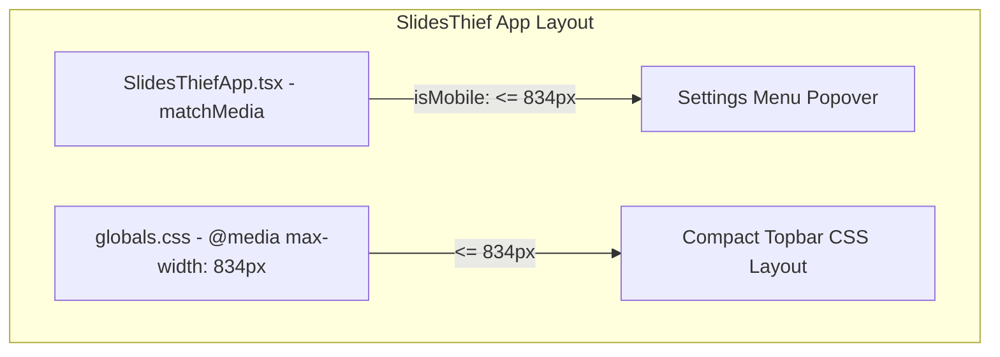

# iPad Responsive Topbar Implementation Plan

> **For agentic workers:** REQUIRED SUB-SKILL: Use superpowers:subagent-driven-development to implement this plan task-by-task. Steps use checkbox (`- [ ]`) syntax for tracking.

**Goal:** Standardize the mobile/compact breakpoint from 720px to 834px in SlidesThief web app to prevent topbar overflow on iPad devices.

**Architecture:** Update the CSS media query rules in `globals.css` and matchMedia breakpoint checks in `SlidesThiefApp.tsx` from 720px to 834px, updating test assertions accordingly.

**Architecture Diagram:**



**Tech Stack:** React, TypeScript, CSS, Node test runner

## Global Constraints
- Target breakpoint threshold: `834px`
- Corner order invariant: top-left, top-right, bottom-right, bottom-left
- Canonical product version preserved
- Keep browser photo processing local

---

### Task 1: Update Breakpoint Logic in `SlidesThiefApp.tsx`

**Files:**
- Modify: `site/app/SlidesThiefApp.tsx:1889-1913,2186,2614,2678`

- [ ] **Step 1: Replace 720px matchMedia breakpoints with 834px**

In [SlidesThiefApp.tsx](file:///Volumes/SN5100/Users/waittim/Documents/Code/Slides-Thief/site/app/SlidesThiefApp.tsx):
- Line 1889: Change `window.matchMedia("(max-width: 720px)")` to `window.matchMedia("(max-width: 834px)")`
- Line 1913: Change `window.matchMedia("(max-width: 720px)").matches` to `window.matchMedia("(max-width: 834px)").matches`
- Line 2186: Change `stage.clientWidth <= 720` to `stage.clientWidth <= 834`
- Line 2614: Change `window.matchMedia("(max-width: 720px)").matches` to `window.matchMedia("(max-width: 834px)").matches`
- Line 2678: Change `window.matchMedia("(max-width: 720px)").matches` to `window.matchMedia("(max-width: 834px)").matches`

- [ ] **Step 2: Run site tests to check impact**

Run: `cd site && npm test`

- [ ] **Step 3: Commit JS breakpoint changes**

```bash
git add site/app/SlidesThiefApp.tsx
git commit -m "refactor(site): raise JS mobile breakpoint to 834px for iPad support"
```

---

### Task 2: Update CSS Breakpoints and Test Assertions

**Files:**
- Modify: `site/app/globals.css:1050,1236,1430,1536`
- Modify: `site/tests/rendered-html.test.mjs:196`

- [ ] **Step 1: Update CSS media queries in `globals.css`**

In [globals.css](file:///Volumes/SN5100/Users/waittim/Documents/Code/Slides-Thief/site/app/globals.css):
- Line 1050: Change `@media (max-width: 720px), (max-height: 600px) and (max-width: 1040px)` to `@media (max-width: 834px), (max-height: 600px) and (max-width: 1040px)`
- Line 1236: Change `@media (max-width: 720px)` to `@media (max-width: 834px)`
- Line 1430: Change `@media (max-width: 720px), (pointer: coarse)` to `@media (max-width: 834px), (pointer: coarse)`
- Line 1536: Change `@media (max-width: 720px), (pointer: coarse)` to `@media (max-width: 834px), (pointer: coarse)`

- [ ] **Step 2: Update test assertions in `rendered-html.test.mjs`**

In [rendered-html.test.mjs](file:///Volumes/SN5100/Users/waittim/Documents/Code/Slides-Thief/site/tests/rendered-html.test.mjs):
- Line 196: Change `/@media \(max-width: 720px\), \(max-height: 600px\) and \(max-width: 1040px\)/` to `/@media \(max-width: 834px\), \(max-height: 600px\) and \(max-width: 1040px\)/`

- [ ] **Step 3: Run all test suites**

Run: `cd site && npm test`
Expected: PASS

Run: `PYTHONDONTWRITEBYTECODE=1 PYTHONPATH=src python3 -m pytest`
Expected: PASS

- [ ] **Step 4: Commit CSS and test changes**

```bash
git add site/app/globals.css site/tests/rendered-html.test.mjs
git commit -m "fix(site): update CSS topbar breakpoint and tests to 834px for iPad support"
```
