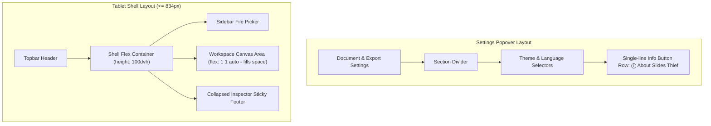

# Implementation Plan: Settings Popover Layout & iPad Workspace Height Fix

> **For agentic workers:** REQUIRED SUB-SKILL: Use superpowers:subagent-driven-development to implement this plan task-by-task. Steps use checkbox (`- [ ]`) syntax for tracking.

**Goal:** Refactor the `settingsMenu` popover layout to format "About (关于)" as a single-line flex row `[ ⓘ 关于 Slides Thief · PPT捕手 ]` with a section divider, and update mobile/tablet CSS (`<= 834px`) so `.workspace` expands dynamically (`flex: 1 1 auto; height: 100%;`), eliminating empty black gaps below `.inspector`.

**Architecture:** Update `SlidesThiefApp.tsx` for `.settingsMenuInfoRow` and `.settingsMenuDivider`. Update `globals.css` to add divider and info button row styles, set `.shell` to flex container and `.workspace` to flex item with `flex: 1 1 auto; height: 100%;` on mobile/tablet viewports (`<= 834px`). Update test assertions if needed.

**Architecture Diagram:**



**Tech Stack:** React, TypeScript, CSS, Node test runner

## Global Constraints
- Target breakpoint threshold: `834px`
- Desktop layout (`> 834px`) must remain unchanged
- Corner order invariant: top-left, top-right, bottom-right, bottom-left
- All test suites must pass (`npm test` & `pytest`)

---

### Task 1: Refactor `settingsMenu` Info Control and Divider in `SlidesThiefApp.tsx`

**Files:**
- Modify: `site/app/SlidesThiefApp.tsx:2852-2886`

- [ ] **Step 1: Update `settingsMenuBody` JSX with divider and single-line `settingsMenuInfoRow`**

In [SlidesThiefApp.tsx](file:///Volumes/SN5100/Users/waittim/Documents/Code/Slides-Thief/site/app/SlidesThiefApp.tsx):
- Add a `<hr className="settingsMenuDivider" />` before the Theme / Language / Info section inside `settingsMenuBody`.
- Replace `.settingsMenuInfo` with `<button type="button" className="settingsMenuInfoRow" onClick={() => setIsInfoOpen(true)}><svg ... /><span>{text.infoTitle}</span></button>`.

- [ ] **Step 2: Run site tests to verify build & JSX syntax**

Run: `cd site && npm test`

- [ ] **Step 3: Commit TSX changes**

```bash
git add site/app/SlidesThiefApp.tsx
git commit -m "refactor(site): format info control as single-line button row with divider in settings menu"
```

---

### Task 2: Update CSS for Popover Layout & Expand Workspace Height in `globals.css`

**Files:**
- Modify: `site/app/globals.css:1056-1180,1295-1325`

- [ ] **Step 1: Add Popover Divider & Info Button Row CSS rules in `globals.css`**

In [globals.css](file:///Volumes/SN5100/Users/waittim/Documents/Code/Slides-Thief/site/app/globals.css):
- Add `.settingsMenuDivider { border: 0; border-top: 1px solid var(--line); margin: 6px 0; grid-column: 1 / -1; }`
- Add `.settingsMenuInfoRow { display: flex; align-items: center; gap: 10px; width: 100%; min-height: 44px; padding: 0 10px; border: 1px solid var(--line); border-radius: 6px; background: var(--control-bg); color: var(--text); cursor: pointer; text-align: left; font-size: 13px; font-weight: 500; grid-column: 1 / -1; }`
- Add `.settingsMenuInfoRow:hover { border-color: var(--control-hover); background: var(--panel-strong); }`

- [ ] **Step 2: Expand Workspace Height under `@media (max-width: 834px)` in `globals.css`**

Under `@media (max-width: 834px)`:
- Update `.shell, .shell.inspectorCollapsed`:
  ```css
  .shell,
  .shell.inspectorCollapsed {
    display: flex;
    flex-direction: column;
    flex: 1 1 auto;
    min-height: 0;
    width: 100%;
    overflow: hidden;
  }
  ```
- Update `.workspace`:
  ```css
  .workspace {
    flex: 1 1 auto;
    min-height: 300px;
    height: 100%;
    width: 100%;
    max-width: 100%;
    min-width: 0;
    border-bottom: 1px solid var(--line);
  }
  ```

- [ ] **Step 3: Run all verification commands**

Run: `cd site && npm test`
Expected: PASS

Run: `PYTHONDONTWRITEBYTECODE=1 PYTHONPATH=src ./.venv/bin/pytest`
Expected: PASS

- [ ] **Step 4: Commit CSS and test changes**

```bash
git add site/app/globals.css
git commit -m "fix(site): expand workspace height on mobile/tablet and style popover divider"
```
