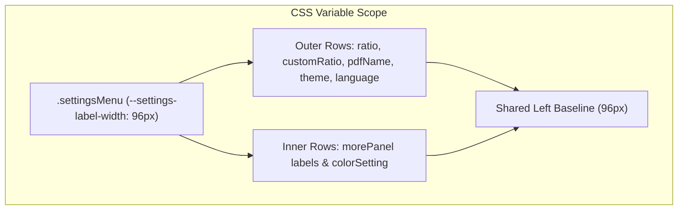

# Implementation Plan: Unify Settings Popover Label Width Alignment

> **For agentic workers:** REQUIRED SUB-SKILL: Use superpowers:subagent-driven-development to implement this plan task-by-task. Steps use checkbox (`- [ ]`) syntax for tracking.

**Goal:** Unify the label column width across all input rows in the `settingsMenu` popover using a CSS variable `--settings-label-width: 96px`, aligning all input boxes to a single vertical left baseline.

**Architecture:** Define `--settings-label-width: 96px` in `globals.css` for `.settingsMenu` and `.settingsMenuBody`, and update all grid label column specifications (`.ratioSetting`, `.sourceCustomSetting`, `.pdfNameSetting`, `.settingsMenuTheme`, `.settingsMenuLanguage`, `.morePanel label`, `.morePanel .colorSetting`) to consume `var(--settings-label-width)`.

**Architecture Diagram:**



**Tech Stack:** CSS, Node test runner

## Global Constraints
- Target breakpoint threshold: `834px`
- Desktop & mobile layouts must maintain strict vertical input alignment
- All test suites must pass (`npm test` & `pytest`)

---

### Task 1: Unify Label Width Variable in `globals.css`

**Files:**
- Modify: `site/app/globals.css:325-345,440-485,1335-1360`

- [ ] **Step 1: Define `--settings-label-width` and update grid column rules in `globals.css`**

In [globals.css](file:///Volumes/SN5100/Users/waittim/Documents/Code/Slides-Thief/site/app/globals.css):
- Set `--settings-label-width: 96px;` on `.settingsMenu` and `.settingsMenuBody`.
- Replace `82px` and `96px` hardcoded grid label widths on `.morePanel label`, `.morePanel .colorSetting`, `.morePanel .checks`, `.settingsMenuBody > .ratioSetting`, `.settingsMenuBody > .sourceCustomSetting`, `.settingsMenuBody > .pdfNameSetting`, `.settingsMenuBody > .settingsMenuTheme`, `.settingsMenuBody > .settingsMenuLanguage` with `var(--settings-label-width)`.

- [ ] **Step 2: Run site tests to verify build & CSS syntax**

Run: `cd site && npm test`
Expected: PASS

Run: `PYTHONDONTWRITEBYTECODE=1 PYTHONPATH=src ./.venv/bin/pytest`
Expected: PASS

- [ ] **Step 3: Commit CSS label width alignment changes**

```bash
git add site/app/globals.css
git commit -m "fix(site): unify settings popover label width to 96px for baseline alignment"
```
